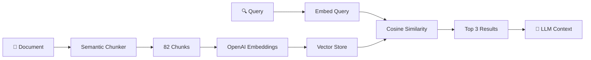

<div align="center">

# 🧠 Gemini Clone

**An AI Agent built with Clean Architecture, RAG, and Real-time Web Search**

[](https://nextjs.org)
[](https://www.typescriptlang.org)
[](https://firebase.google.com/docs/genkit)
[](./src)

</div>

---

## 🎯 Overview

A conversational AI agent that demonstrates **Clean Architecture** principles with real-world AI capabilities:

- 🔍 **Web Search** - Real-time information via Tavily API
- 📚 **RAG (Retrieval-Augmented Generation)** - Semantic search over local documents using OpenAI embeddings
- 🤖 **Multi-Model Support** - Gemini 2.5 Flash & GPT-4o
- 🛠️ **Function Calling** - Intelligent tool selection by the LLM

---

## 🏗️ Architecture

This project follows **Clean Architecture** with **Domain-Driven Design (DDD)** principles:

```
src/
├── core/                          # 🎯 DOMAIN LAYER (Pure TypeScript)
│   ├── domain/
│   │   ├── entities/              # Conversation, Message
│   │   ├── value-objects/         # MessageRole, MessageContent
│   │   ├── interfaces/            # Repository contracts
│   │   └── ports/                 # Tool interfaces (WebSearch, KnowledgeBase)
│   └── application/
│       ├── use-cases/             # SendMessageUseCase
│       └── dto/                   # Request/Response DTOs
│
├── infrastructure/                # 🔌 ADAPTERS LAYER
│   ├── ai/
│   │   ├── GenkitAgent.ts         # LLM orchestrator
│   │   ├── genkit/                # Modular AI components
│   │   │   ├── GenkitClient.ts    # AI client initialization
│   │   │   ├── ToolRegistry.ts    # Tool definitions
│   │   │   └── MessageConverter.ts
│   │   └── prompts/
│   │       ├── PromptLoader.ts    # Prompt utilities
│   │       └── system.prompt      # Agent instructions
│   ├── repositories/              # InMemoryConversationRepository
│   └── tools/
│       ├── implementation/        # Tavily, LocalVectorKnowledgeBase
│       └── utils/                 # semanticChunker
│
└── app/                           # 🖥️ PRESENTATION LAYER (Next.js)
    ├── page.tsx                   # Chat UI
    └── api/chat/route.ts          # API endpoint
```

### Dependency Flow

```
UI (React) → API Route → Use Case → Domain ← Ports
                                        ↑
                              Infrastructure (Adapters)
```

> **Key Principle**: Inner layers know nothing about outer layers. Domain is pure TypeScript with zero framework dependencies.

---

## ✨ Features

### 🔍 Web Search (Tavily)
Real-time information from the internet for current events, prices, and external documentation.

### 📚 RAG with OpenAI Embeddings
- **Model**: `text-embedding-3-small` (1536 dimensions)
- **Semantic Chunking**: Intelligent sentence-aware splitting with overlap
- **Cosine Similarity**: Vector search with 0.3 threshold
- **Document**: Processes `rag_survey.md` (22K+ chars, 82 semantic chunks)

### 🤖 Multi-Model Support
| Model ID | Provider | Use Case |
|----------|----------|----------|
| `googleai/gemini-2.5-flash` | Google | Default, fast responses |
| `openai/gpt-4o` | OpenAI | Alternative model |

### 🛠️ Intelligent Tool Selection
The agent uses function calling to decide which tool to use:
- Questions about RAG → `knowledge_base` tool
- Current events/prices → `web_search` tool
- General queries → Direct LLM response

---

## 🚀 Quick Start

### Prerequisites
- Node.js 18+
- pnpm (recommended)

### 1. Clone & Install
```bash
git clone https://github.com/MarcoLopezf/Gemini-clone.git
cd gemini-web
pnpm install
```

### 2. Configure Environment
```bash
cp .env.example .env
```

Edit `.env` with your API keys:
```env
GOOGLE_GENAI_API_KEY=your_google_key
TAVILY_API_KEY=your_tavily_key
OPENAI_API_KEY=your_openai_key
```

### 3. Run Development Server
```bash
pnpm dev
```

Open [http://localhost:3000](http://localhost:3000)

---

## 🧪 Development Methodology

### Strict TDD (Test-Driven Development)

Every feature follows the **Red-Green-Refactor** cycle:

```
🔴 RED    → Write failing tests first
🟢 GREEN  → Write minimal code to pass
🔵 REFACTOR → Improve while keeping tests green
```

### Verification Command
```bash
pnpm verify  # Runs: lint → typecheck → test → build
```

### Test Coverage
```
58 tests across 8 test files
- Domain entities & value objects
- Use cases
- Infrastructure adapters
- RAG semantic chunking
```

---

## 📁 Key Files

| File | Purpose |
|------|---------|
| `GenkitAgent.ts` | LLM orchestrator (~110 lines after refactor) |
| `LocalVectorKnowledgeBase.ts` | RAG implementation with OpenAI embeddings |
| `semanticChunker.ts` | Intelligent document chunking |
| `TavilySearchProvider.ts` | Web search adapter |
| `SendMessage.ts` | Core use case |
| `system.prompt` | Agent behavior instructions |

---

## 🧠 RAG Pipeline



### Chunking Strategy
| Feature | Value |
|---------|-------|
| Chunk Size | ~500 chars |
| Overlap | 100 chars |
| Strategy | Sentence-aware (no mid-sentence cuts) |

---

## 🔧 Technical Challenges & Solutions

### 1. Async Indexing Race Condition
**Problem**: First requests could fail if RAG indexing wasn't complete.

**Solution**: Promise-based initialization guard. `search()` awaits the indexing promise.

### 2. Genkit Embed Return Type
**Problem**: `ai.embed()` return type varies across versions.

**Solution**: `extractEmbedding()` helper that handles multiple formats.

### 3. GenkitAgent Size (252 lines)
**Problem**: Single file with multiple responsibilities.

**Solution**: Extracted into modular components:
- `GenkitClient.ts` - AI initialization
- `ToolRegistry.ts` - Tool management
- `MessageConverter.ts` - Message formatting
- `PromptLoader.ts` - Prompt loading

---

## 📊 Project Stats

| Metric | Value |
|--------|-------|
| Lines of Code | ~2,500 |
| Test Files | 8 |
| Tests | 58 |
| API Integrations | 3 (Google AI, OpenAI, Tavily) |

---

## 🛣️ Roadmap

- [ ] Rate limiting with Upstash
- [ ] Authentication (NextAuth)
- [ ] Persistent storage (Drizzle + SQLite)
- [ ] Streaming responses
- [ ] Multi-document RAG
- [ ] File upload support

---

## 📄 License

MIT © Marco Lopez

---

<div align="center">

**Built with ❤️ using Clean Architecture principles**

[Report Bug](https://github.com/MarcoLopezf/Gemini-clone/issues) · [Request Feature](https://github.com/MarcoLopezf/Gemini-clone/issues)

</div>
